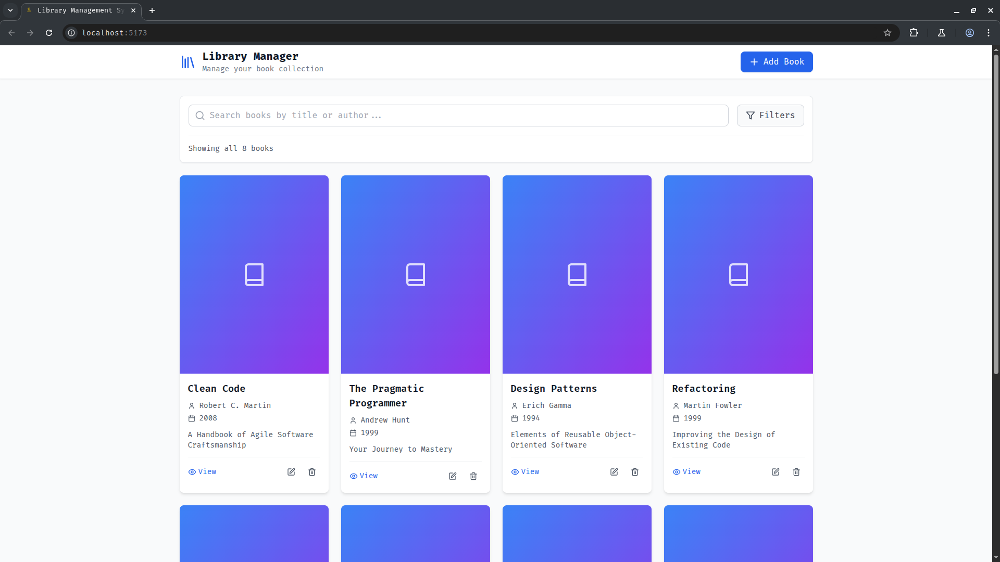
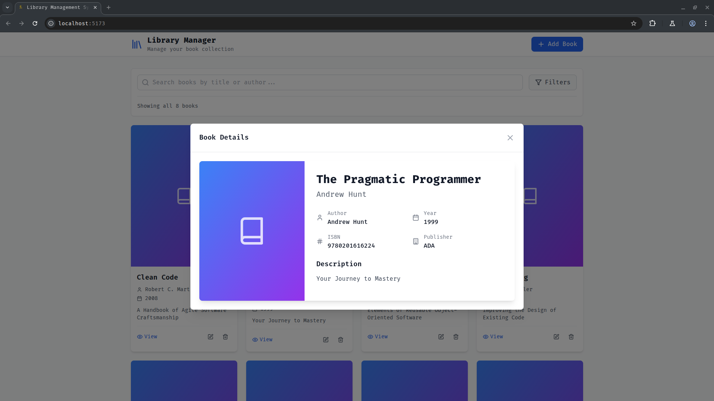
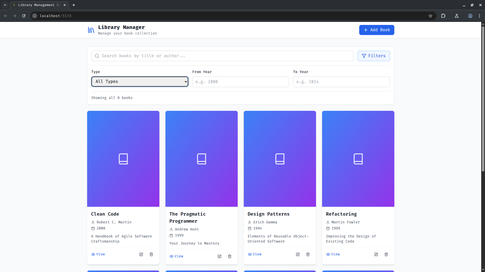
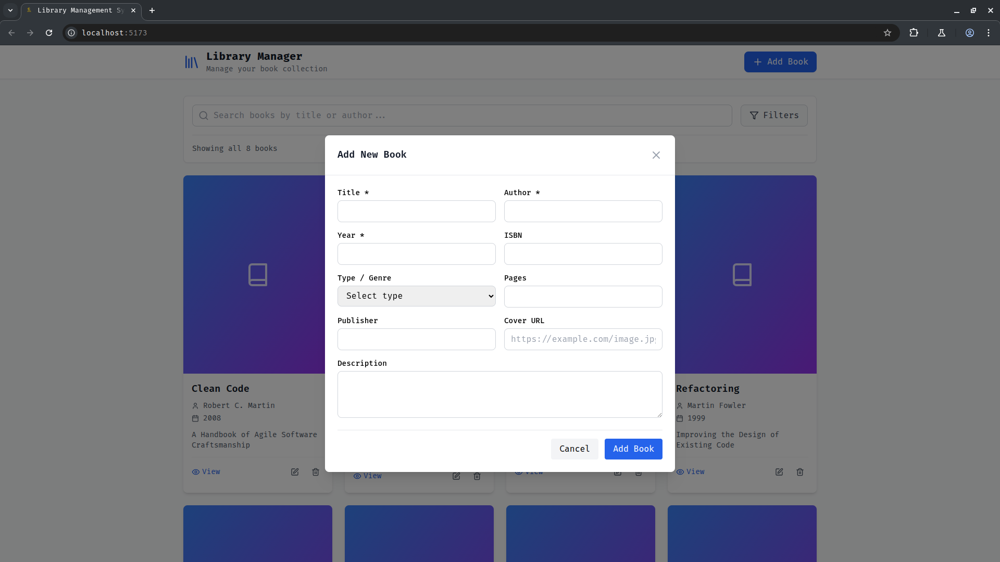
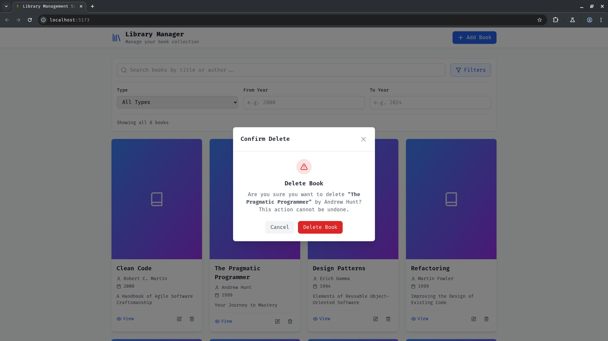
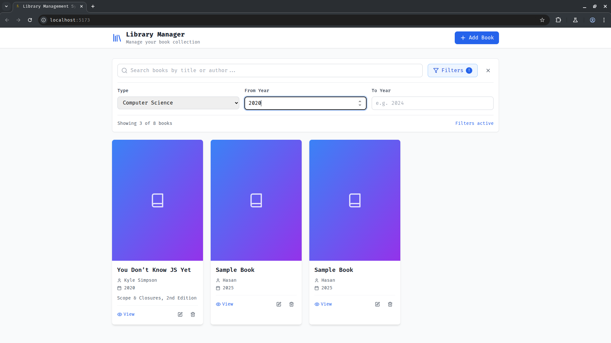

# 🚀 TaskGo – Full-Stack Library & Smart URL Platform

A monorepo combining a React/Next.js frontend with a Go backend. Spin up locally in seconds with Docker Compose or deploy to any cloud. Fully containerized, tested, linted, and documented with Swagger & Storybook.

> 📁 Frontend: `Frontend/`
> 🖥️ Backend: `Backend/`

---

## 🧭 Overview

| App      | Stack                                 | Docs                 |
| -------- | ------------------------------------- | -------------------- |
| Backend  | Go · Gin · GORM · SQLite · Swagger    | `Backend/README.md`  |
| Frontend | Next.js 14 · React 18 · Tailwind · TS | `Frontend/README.md` |

---

## 🗂️ Project Structure

```
TaskGo/
├── Backend/          # Go REST API (handlers, middleware, Swagger)
├── Frontend/         # Next.js 14 (App Router), Tailwind, Vitest
├── assets/           # UI screenshots
├── docker-compose.yml
└── README.md
```

### 🔖 Backend Highlights

```
Backend/
├── handlers/       # Book, URL, Health handlers
├── middleware/     # Logger, Rate Limiter
├── docs/           # Swagger UI & JSON
├── tests/          # Unit/integration (80%+ coverage)
├── Dockerfile      # Multi-stage (14MB output)
└── Makefile        # Shortcuts (lint, test, dev…)
```

### 🖼 Frontend Highlights

```
Frontend/
├── app/            # App Router (Next.js 14)
├── components/     # BookCard, BookForm, etc.
├── context/        # Global Book state
├── test/           # Vitest + Testing Library
├── public/         # Icons & static assets
├── Dockerfile      # Alpine Node → Nginx build
└── Makefile        # Lint/test/dev helpers
```

---

## 🔧 .env Files

Each service uses a separate `.env`.

### 📡 Backend (.env)

```env
HTTP_PORT=8080
APP_ENV=dev
DB_DSN=books.db
RATE_LIMIT_RPS=60
```

### 🌐 Frontend (.env)

```env
NEXT_PUBLIC_API_URL=http://localhost:8080
NEXT_PUBLIC_APP_PORT=3000
```

> 📝 Ports auto-applied by Docker Compose

---

## 🧪 Local Development

### 🔨 Requirements

* Docker 24+
* Docker Compose v2
* GNU Make

### 🚀 Quick Start

```bash
git clone https://github.com/hasan-kayan/TaskGo.git
cd TaskGo
make up  # = docker compose up --build -d
```

| App      | URL                                                              |
| -------- | ---------------------------------------------------------------- |
| Frontend | [http://localhost:3000](http://localhost:3000)                   |
| Backend  | [http://localhost:8080](http://localhost:8080)                   |
| Swagger  | [http://localhost:8080/swagger/](http://localhost:8080/swagger/) |

> Stop stack: `make down`

### 🔄 Hot Reload (Optional)

```bash
cd Backend && make dev       # Air (Go)
cd Frontend && make dev      # Next.js dev
```

---

## 📸 UI Preview

<table>
<tr>
<td></td>
<td></td>
<td></td>
</tr>
<tr>
<td></td>
<td></td>
<td></td>
</tr>
<tr>
<td></td>
<td></td>
<td></td>
</tr>
</table>

---

## ⚙️ Make Commands (Root)

| Command     | Action                                      |
| ----------- | ------------------------------------------- |
| `make up`   | `docker compose up --build -d`              |
| `make down` | Stop and clean containers/volumes           |
| `make lint` | Run backend (Go) + frontend (TS/ES) linters |
| `make test` | Run backend + frontend test suites          |
| `make e2e`  | Cypress UI end-to-end tests (headless)      |

---

## 🛠 Backend Makefile Cheatsheet

The backend ships with a feature‑rich **Makefile** (`Backend/Makefile`) that wraps common developer tasks behind short, colourful commands.

```bash
# 1) Install/update tooling (swag, air, golangci‑lint)
cd Backend && make deps

# 2) Launch API with hot‑reload
make dev

# 3) Lint & test
make lint
make test   # includes race‑detector & coverage

# 4) Container image
make docker   # → taskgo-backend:latest
make run      # run image on $PORT (default 8080)
```

| Target     | Description                                                               |
| ---------- | ------------------------------------------------------------------------- |
| `deps`     | `go mod tidy` **+** fetch **swag**, **air**, **golangci‑lint** if missing |
| `docs`     | Regenerate Swagger docs into `Backend/docs/`                              |
| `dev`      | Start the API with live‑reload (Air) – falls back to `go run .`           |
| `lint`     | Static checks: `go vet` + `golangci‑lint run`                             |
| `test`     | `go test -v -race -cover` across *all* packages                           |
| `coverage` | Show text summary & hint to open HTML report                              |
| `docker`   | Multi‑stage build → **taskgo-backend\:latest** (≈14 MB)                   |
| `run`      | Run container mapping `${PORT}`→8080                                      |
| `clean`    | Delete `coverage.out` & generated Swagger artefacts                       |

All targets log with emoji & ANSI colours so you can *see* progress at a glance 🎉

---

## 📦 Production Build

```bash
# Backend
cd Backend && make docker

# Frontend
cd Frontend && make docker
```

Or deploy together:

```bash
docker compose -f docker-compose.prod.yml up -d
```

CI/CD, Helm, and Kubernetes manifests are available under `/deploy/`.

---

## 🧪 Testing

```bash
# Backend test & coverage
cd Backend && make test

# Frontend unit tests
cd Frontend && make test
```

Contract tests live in `/docs/postman/` (collection).

---

## 📚 Full Docs

* 🧠 Backend API: [Backend/README.md](Backend/README.md)
* 🎨 Frontend UI: [Frontend/README.md](Frontend/README.md)

Includes usage details, env switching, CLI docs, architecture overviews & more.

---

## 👨‍💻 Author

**Hasan Kayan** — [hasankayan.com](https://www.hasankayan.com) · [GitHub](https://github.com/hasan-kayan)

> *Build libraries, not excuses!* 📚🔥
